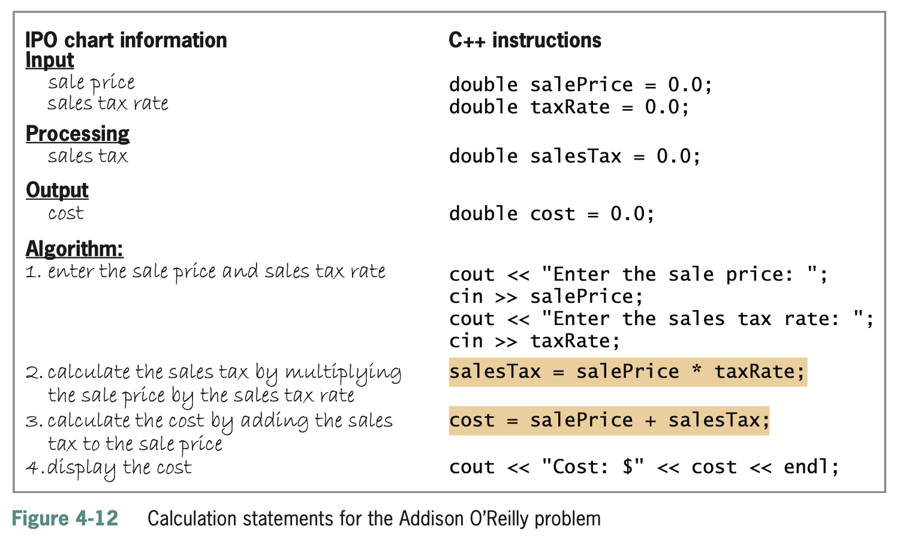

[](https://classroom.github.com/a/JU8K8Q_i)
# These assignments directly correspond with assignments in your book. For further details and references, please refer to the approriate sections in your textbook, and if you need further clarification, please reach out.

# Lab 4-2 Plan and Create

1. **Read textbook pages 95 through 97. Note that your book gives instructions for setting up development tools and a development environment. Ignore those instructions. We are using Replit instead. Figure 4-27 on page 97 gives the final C++ instructions to be submitted. Please do not just copy and paste. Working through Lab 4-2 will get you used to developing, building, testing, and pushing/submitting your code**i

2. **Test the program using the same data used to desk-check the program. You can compile and run your code with the following commands:**
```
make clean
make lab4-2
./lab4-2
```
**You can also use the unit test for testing your code by running the following:** 
``` 
make test_lab4-2
./test_files/test_lab4-2
```

3. **When you are done, push your code to the Github classroom. A Github Action will grade your lab.**

# Lab 4-3 Modify

1. **Modify the the program from lab4-2.cpp. to allow the user to enter the commission rate (in decimal form). Test the program twice. For the first test, use 1328.50 and .1 as the sales amount and commission rate respectively. For the second test, use 267.90 and .15. (Don’t be concerned that the $40.185  has three decimal places. You will learn how to format numbers in Chapter 5.)**

2. **Test the program using the same data used to desk-check the program. You can compile and run your code with the following commands:**
```
make clean
make lab4-3
./lab4-3
```
**You can also use the unit test for testing your code by running the following:** 
``` 
make test_lab4-3
./test_files/test_lab4-3
```

3. **When you are done, push your code to the Github classroom. A Github Action will grade your lab.**

# Lab 4-4 What's missing?

1. **The C++ code in lab4-4.cpp is out of order and missing a few lines of code. It is currently a non-functioning program. Fix the program and add the missing lines of code. The program in this lab should calculate and display the volume of a cylinder, given the cylinder’s radius (r) and height (h), and using 3.14 as the value of pi. The formula for calculating the volume is π*r*r*h.**

2. **Test the program using the same data used to desk-check the program. You can compile and run your code with the following commands:**
```
make clean
make lab4-4
./lab4-4
```
**You can also use the unit test for testing your code by running the following:** 
``` 
make test_lab4-4
./test_files/test_lab4-4
```

3. **When you are done, push your code to the Github classroom. A Github Action will grade your lab.**

# Lab 4-6 Debug

1. **The program should calculate and display the area of a triangle, but it is not working correctly. Run and then debug the program.**

2. **Test the program using the same data used to desk-check the program. You can compile and run your code with the following commands:**
```
make clean
make lab4-6
./lab4-6
```
**You can also use the unit test for testing your code by running the following:** 
``` 
make test_lab4-6
./test_files/test_lab4-6
```

3. **When you are done, push your code to the Github classroom. A Github Action will grade your lab.**

# Exercise 4-11 Savings Account Balance Program

Jacob Weinstein wants a program that displays his savings account balance at the end of the month, given the beginning balance, total deposits, and total withdrawals.

1. **Using the chart shown earlier in Figure 4-12 as a guide, enter the input, processing, and output items, as well as the algorithm, in the first column.**



2. **Desk-check the algorithm twice.**
   - For the first desk-check, use:
     - Beginning balance: 2545.75
     - Total deposits: 409.43
     - Total withdrawals: 210.65
   - For the second desk-check, use:
     - Beginning balance: 1125.33
     - Total deposits: 23
     - Total withdrawals: 800.94

3. **Enter the C++ instructions in the second column of the chart, and then desk-check the program using the same data used to desk-check the algorithm.**

4. **After completing Step 3, Enter your C++ instructions into the source file named hw4-11.cpp. Also enter appropriate comments and any additional instructions required by the compiler. Test the program using the same data used to desk-check the program. You can compile and run your code with the following commands:
```
make clean
make hw4-11
./hw4-11
```
You can also use the unit test for testing your code by running the following:** 

``` 
make test_hw4-11
./test_files/test_hw4-11
```

5. **After you are done with the assignment submit to github classroom** 

# Exercise 4-12 Pizzeria Sales Program

Silvia’s Pizzeria sells four different sizes of pizzas: small, medium, large, and family. The manager of the pizzeria wants a program that displays the total number of pizzas sold, as well as the percentage of the total number contributed by each different size.

1. **Using the chart shown earlier in Figure 4-12 as a guide, enter the input, processing, and output items, as well as the algorithm, in the first column.**


2. **Desk-check the algorithm twice.**
   - For the first desk-check, use:
     - Small pizzas: 25
     - Medium pizzas: 50
     - Large pizzas: 50
     - Family pizzas: 75
   - For the second desk-check, use:
     - Small pizzas: 30
     - Medium pizzas: 25
     - Large pizzas: 85
     - Family pizzas: 73
   - Record the percentages with one decimal place.

3. **Enter the C++ instructions in the second column of the chart, and then desk-check the program using the same data used to desk-check the algorithm.**

4. **After completing Step 3, enter your C++ instructions into the source file named hw4-12.cpp. Also enter appropriate comments and any additional instructions required by the compiler. Test the program using the same data used to desk-check the program. You can compile and run your code with the following commands:**

```sh
make clean
make hw4-12
./hw4-12
```

**You can also use the unit test for testing your code by running the following:**

```
make test_hw4-12
./test_files/test_hw4-12
```

5. **After you are done with the assignment submit to github classroom** 

# Exercise 4-16 Monetary Calculations Program

In this exercise, you explore the use of integers in monetary calculations.

1. **Follow the instructions for starting C++ and opening the hw4-16.cpp file. Run the program. Enter 256.7 and 223.3 as the sales for Store 1 and Store 2, respectively. The total that appears on the computer screen (504.00) is incorrect because it is not the result of adding together the numbers 269.54 and 234.47. Press any key to stop the program.**

2. **Review the code contained in the hw4-16.cpp file. The `#include <iomanip>` directive tells the C++ compiler to include the contents of the iomanip file in the current program. The file contains the definition of the `setprecision` stream manipulator, which appears in the `cout << fixed << setprecision(2) << endl;` statement. The `fixed` stream manipulator, which is defined in the iostream file, forces a real number to display a specific number of decimal places, as specified by the `setprecision` stream manipulator. In this program, the output values will display with two decimal places. You will learn about the directive and both stream manipulators in Chapter 5.**

3. **Why does the total appear as 504.00 rather than 504.01? Hint: Change the `cout << fixed << setprecision(2);` statement to a comment, and then save and run the program. Enter 256.7 and 223.3 as the sales for Store 1 and Store 2, respectively. Study the output, and then stop the program. Change the comment back to a statement.**

4. **Use the seven comments that appear below the main function to modify the program’s code. Why do you need to add .5 to the expressions that calculate the increased sales for both stores?**

5. **Save, run, and test the program to verify that it is working correctly, and then stop the program.**

```sh
make clean
make hw4-16
./hw4-16
```

**You can also use the unit test for testing your code by running the following:**

```
make test_hw4-16
./test_files/test_hw4-16
```

6. **After you are done with the assignment submit to github classroom** 

